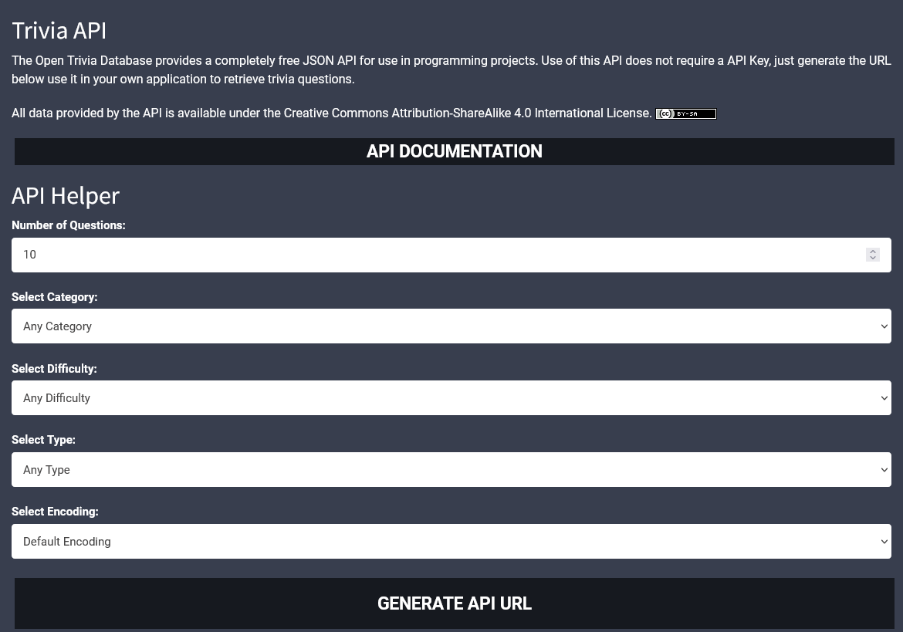

# JS 3 - Komptenzcheck Quiz Web App Erweiterung

Ziel: Das Ziel dieser Übung ist es, die Quiz-Webanwendung aus dem Kompetenzcheck 2 zu erweitern.
Die statischen Daten aus dem ersten Kompetenzchecks werdet ihr jetzt mit Daten von der TRIVIA-API ersetzen.

**Hier der Link zur API:**
https://opentdb.com/api_config.php

Hier könnt ihr die Anzahl der Fragen, die Kategorie, den Schwierigkeitsgrad & den Typ der Quizfragen auswählen.
- Bei Number of Questions -> *9*
- Beim Typ -> *Multiple Choice*
- Beim Encoding -> *Default Encoding*

Der Button 'Generate API URL' generiert euch die URL mit der ihr den API Request aus dem Frontend machen könnt.

Ersetze in deinem Programm das statische Datenarray mit den Daten aus der Response vom API Call.

Apaptiere das restliche Programm so, dass das Quiz wieder voll funktionsfähig ist.

### Bonusaufgabe:
Gib den Benutzer:innen die Möglichkeit auszuwählen wie viele Fragen sie beantworten möchten. Passe danach den API Request dementsprechend an.
Achtung: deine Oberfläche soll sich dynamisch anpassen.

**EN:**

# JS 3 - Competence Check Quiz Web App Extension

Goal: The aim of this exercise is to extend the quiz web application from Competency Check 2. You will now replace the static data from the first competency check with data from the TRIVIA API.

**Here's the link to the API:**
https://opentdb.com/api_config.php

Here, you can select the number of questions, the category, the difficulty level, and the type of quiz questions.

- For Number of Questions -> **9**
- For Type -> Multiple Choice
- For Encoding -> Default Encoding

The 'Generate API URL' button generates the URL for you to make the API request from the frontend.

Replace the static data array in your program with the data from the response of the API call.

Adapt the remaining program so that the quiz is fully functional again.

### Bonus Task:

Give users the option to select how many questions they want to answer. Then adjust the API request accordingly.
Note: Your interface should adapt dynamically.

